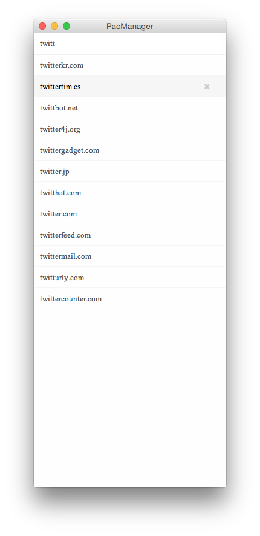

Pac Manager
===========

*This repository is based on Vuejs, Seajs and node-webkit.*

 

This manager can parse the default **PAC file** of [ShadowsocksX](https://github.com/shadowsocks/shadowsocks-iOS/tree/master/ShadowsocksX). You can add new domain and delete one conveniently.

